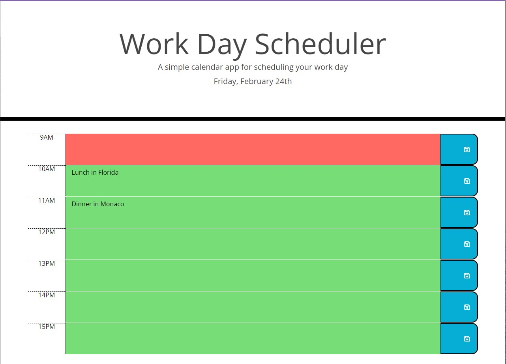
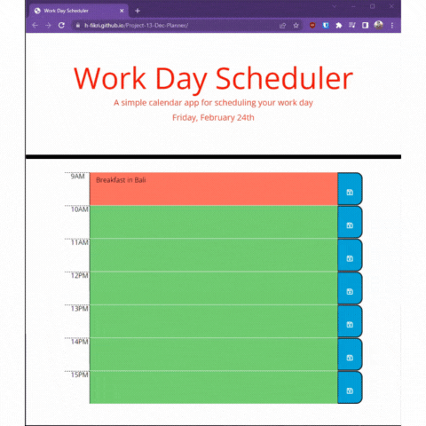

# Project-13-Dec-Planner

- Daily Planner using Moment.js
- Repository Link: https://github.com/h-fikri/Project-13-Dec-Planner
- Deployment Link: https://h-fikri.github.io/Project-13-Dec-Planner/

## Task

Create a simple calendar application that allows a user to save events for each hour of the day by modifying starter code. This app will run in the browser and feature dynamically updated HTML and CSS powered by jQuery.

You'll need to use the [Moment.js](https://momentjs.com/) library to work with date and time. Be sure to read the documentation carefully and concentrate on using Moment.js in the browser.

- Display the current day at the top of the calender when a user opens the planner.

- Present timeblocks for standard business hours when the user scrolls down.

- Color-code each timeblock based on past, present, and future when the timeblock is viewed.

- Allow a user to enter an event when they click a timeblock

- Save the event in local storage when the save button is clicked in that timeblock.

- Persist events between refreshes of a page

## Challenges

Jquery helps me so much instead of writing a lot of code. The principle of DRY really applies in here. However, reading through MomentJS documentation is a bit challenging. I have to read it several times to understand the concept. I also have to re-read the documentation of Jquery to understand how to use them.

## Screenshots

